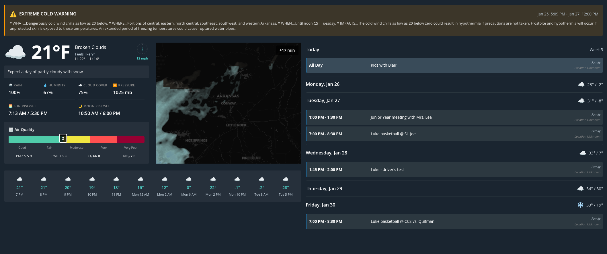
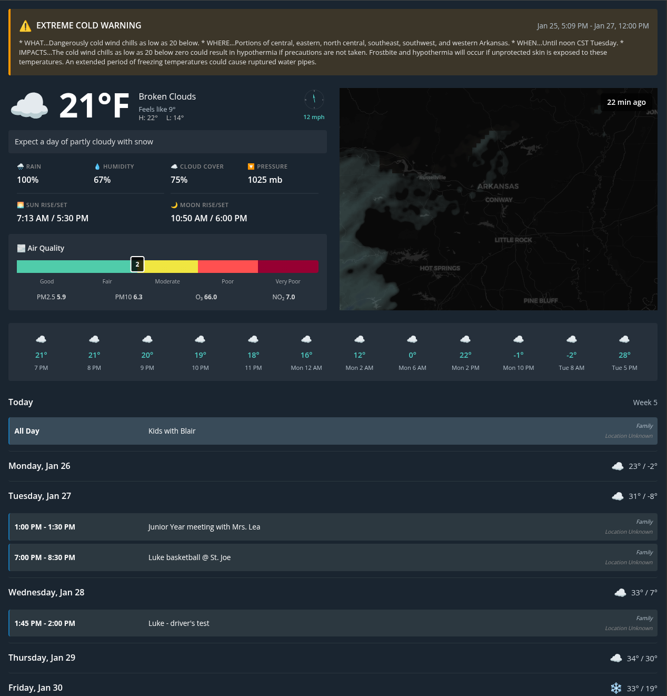

# magi-cal-display

A split-screen weather and calendar dashboard for always-on displays.

## Screenshots

### Landscape Mode


### Portrait Mode


## About

magi-cal-display is a containerized web application designed to turn any screen into an information hub. Originally created for a Raspberry Pi-powered display, it combines real-time weather data with calendar events in a clean, split-screen interface optimized for 24/7 viewing.

The name "magi-cal" is a play on "magical calendar" - bringing together weather forecasts and calendar events in one glanceable display.

## Features

### Weather Section
- **Current Conditions**: Temperature, feels like, humidity, wind speed
- **Air Quality**: Real-time AQI with visual scale and pollutant breakdown (PM2.5, PM10, O₃, NO₂)
- **Hourly Forecast**: 12-hour forecast with temperatures and conditions
- **8-Day Forecast**: Extended outlook with high/low temperatures
- **Weather Alerts**: Severe weather warnings with date ranges
- **Live Radar**: Smooth animated precipitation radar with preloaded frames showing 30 minutes past and 30 minutes future with timestamp overlay

### Calendar Section
- **Multiple Calendars**: Support for multiple Google Calendar feeds
- **Color-Coded Events**: Each calendar gets its own color
- **Multi-Day Events**: Proper handling of events spanning multiple days
- **Smart Grouping**: Events grouped by date for easy scanning
- **Auto-Refresh**: Stays in sync with your calendars

### Layout
- **Landscape Mode**: Weather on left, calendar on right (side-by-side)
- **Portrait Mode**: Weather on top, calendar on bottom (stacked)
- **Responsive**: Automatically adapts to screen orientation

### Technical Features
- **Single Container**: Runs entirely in one container (Podman or Docker)
- **Configurable Location**: Set any location via latitude/longitude
- **Configurable Refresh**: Adjust update frequency via environment variable
- **Low Resource Usage**: Optimized for Raspberry Pi and other low-power devices
- **Dark Theme**: Easy-to-read interface for 24/7 display
- **Platform Agnostic**: Runs on Linux, macOS, Windows with container runtime

## Quick Start

### Prerequisites
- Container runtime (Podman or Docker)
- OpenWeatherMap API key (free tier: https://openweathermap.org/api)
- Google Calendar iCal URLs (see Configuration section)

### Local Installation

1. Clone the repository:
   ```bash
   git clone https://github.com/TylerJPresley/magi-cal-display.git
   cd magi-cal-display
   ```

2. Copy and edit the environment file:
   ```bash
   cp magi-cal-display.env.list.example magi-cal-display.env.list
   vim magi-cal-display.env.list
   ```

3. Build the container:
   ```bash
   # Using Podman
   podman build -t magi-cal-display .
   
   # Using Docker
   docker build -t magi-cal-display .
   ```

4. Run the container:
   ```bash
   # Using Podman
   podman run -d --name magi-cal-display --replace -p 3000:3000 --env-file magi-cal-display.env.list --restart always magi-cal-display:latest
   
   # Using Docker
   docker run -d --name magi-cal-display -p 3000:3000 --env-file magi-cal-display.env.list --restart always magi-cal-display:latest
   ```

5. Open http://localhost:3000 in your browser

### Remote Linux Server Installation

1. SSH into your Linux server:
   ```bash
   ssh user@your-server-ip
   ```

2. Install container runtime (if not already installed):
   ```bash
   # For Debian/Ubuntu
   sudo apt update && sudo apt install -y podman
   # or
   sudo apt update && sudo apt install -y docker.io
   
   # For Fedora/RHEL
   sudo dnf install -y podman
   # or
   sudo dnf install -y docker
   ```

3. Clone the repository:
   ```bash
   git clone https://github.com/TylerJPresley/magi-cal-display.git
   cd magi-cal-display
   ```

4. Create and edit the environment file:
   ```bash
   cp magi-cal-display.env.list.example magi-cal-display.env.list
   nano magi-cal-display.env.list
   ```

5. Build and run:
   ```bash
   # Using Podman
   podman build -t magi-cal-display .
   podman run -d --name magi-cal-display --replace -p 3000:3000 --env-file magi-cal-display.env.list --restart always magi-cal-display:latest
   
   # Using Docker
   docker build -t magi-cal-display .
   docker run -d --name magi-cal-display -p 3000:3000 --env-file magi-cal-display.env.list --restart always magi-cal-display:latest
   ```

6. Access from your browser: http://your-server-ip:3000

## Configuration

### Required Environment Variables

Edit `magi-cal-display.env.list` with the following:

```bash
# OpenWeatherMap API Key (required)
OPENWEATHER_API_KEY=your_api_key_here

# Google Calendar iCal URLs (required, comma-separated)
ICAL_URLS=https://calendar.google.com/calendar/ical/calendar1/private-xxx/basic.ics,https://calendar.google.com/calendar/ical/calendar2/private-yyy/basic.ics

# Location coordinates (required)
LOCATION_LAT=35.0887
LOCATION_LON=-92.4421

# Refresh interval in seconds (optional, default: 120)
REFRESH_INTERVAL=120

# Hourly forecast indices (optional, default: 1,2,3,4,5,6,8,12,20,28,38,47)
# Comma-separated list of hour indices from 0-47 to display
HOURLY_INDICES=1,2,3,4,5,6,8,12,20,28,38,47

# Server port (optional, default: 3000)
PORT=3000
```

### Getting an OpenWeatherMap API Key

1. Go to https://openweathermap.org/api
2. Sign up for a free account
3. Subscribe to "One Call API 3.0" (free tier: 1000 calls/day)
4. Copy your API key from the dashboard

### Getting Google Calendar iCal URLs

1. Go to [Google Calendar](https://calendar.google.com)
2. Click the three dots next to a calendar
3. Select "Settings and sharing"
4. Scroll to "Integrate calendar"
5. Copy the "Secret address in iCal format" URL
6. Repeat for each calendar you want to display
7. Add all URLs to `ICAL_URLS`, separated by commas (no spaces)

**Important:** Use the SECRET iCal URL, not the public one, to ensure privacy.

### Finding Your Location Coordinates

1. Go to [Google Maps](https://maps.google.com)
2. Right-click on your location
3. Click the coordinates to copy them
4. First number is latitude, second is longitude

## Security

This application is designed for local network use. To keep it secure:

### Network-Level Security (Recommended)

1. **Bind to localhost only** (default in examples):
   ```bash
   -p 127.0.0.1:3000:3000  # Only accessible from the host machine
   ```

2. **Bind to local network** (for access from other devices):
   ```bash
   -p 3000:3000  # Accessible from any device on your network
   ```

3. **Use firewall rules** to restrict access:
   ```bash
   # Allow only specific IP addresses
   sudo ufw allow from 192.168.1.0/24 to any port 3000
   
   # Or allow only specific devices
   sudo ufw allow from 192.168.1.100 to any port 3000
   ```

### Important Security Notes

- **Do not expose this application directly to the internet** - it has no authentication
- Your OpenWeatherMap API key and calendar URLs are accessible to anyone who can reach the endpoints
- If you need internet access, use a VPN or reverse proxy with authentication (nginx, Caddy, Traefik)
- The application is designed for trusted local network environments

### Protecting Your API Keys

- Keep your `magi-cal-display.env.list` file secure (it's in `.gitignore`)
- Don't share your OpenWeatherMap API key
- Use Google Calendar's SECRET iCal URLs, not public ones
- Regularly rotate your API keys if you suspect they've been compromised

## Use Cases

- **Home Dashboard**: Always-on display in kitchen, office, or entryway
- **Office Display**: Shared calendar and weather for teams
- **Kiosk Mode**: Full-screen display on dedicated monitor or tablet
- **Raspberry Pi Project**: Low-power, always-on information display
- **Digital Signage**: Weather and events for public spaces (on trusted networks)

## Linux Deployment

### Auto-Start with Systemd

To automatically start the container on boot, create a systemd service:

**For Podman:**

```bash
sudo nano /etc/systemd/system/magi-cal-display.service
```

```ini
[Unit]
Description=magi-cal-display Container
After=network.target

[Service]
Type=simple
User=YOUR_USERNAME
WorkingDirectory=/path/to/magi-cal-display
ExecStart=/usr/bin/podman run --name magi-cal-display --replace -p 3000:3000 --env-file /path/to/magi-cal-display.env.list magi-cal-display:latest
ExecStop=/usr/bin/podman stop magi-cal-display
Restart=always
RestartSec=10

[Install]
WantedBy=multi-user.target
```

**For Docker:**

```bash
sudo nano /etc/systemd/system/magi-cal-display.service
```

```ini
[Unit]
Description=magi-cal-display Container
After=network.target docker.service
Requires=docker.service

[Service]
Type=simple
User=YOUR_USERNAME
WorkingDirectory=/path/to/magi-cal-display
ExecStartPre=-/usr/bin/docker stop magi-cal-display
ExecStartPre=-/usr/bin/docker rm magi-cal-display
ExecStart=/usr/bin/docker run --name magi-cal-display -p 3000:3000 --env-file /path/to/magi-cal-display.env.list magi-cal-display:latest
ExecStop=/usr/bin/docker stop magi-cal-display
Restart=always
RestartSec=10

[Install]
WantedBy=multi-user.target
```

Enable and start the service:

```bash
sudo systemctl daemon-reload
sudo systemctl enable magi-cal-display.service
sudo systemctl start magi-cal-display.service
```

Check status:

```bash
sudo systemctl status magi-cal-display.service
```

### Kiosk Mode (Full-Screen Display)

For a dedicated display running in kiosk mode:

1. Install a browser:
   ```bash
   sudo apt install -y chromium-browser unclutter
   ```

2. Create autostart script:
   ```bash
   mkdir -p ~/.config/autostart
   nano ~/.config/autostart/magi-cal-display-kiosk.desktop
   ```

3. Add the following:
   ```ini
   [Desktop Entry]
   Type=Application
   Name=magi-cal-display Kiosk
   Exec=/usr/bin/chromium-browser --kiosk --noerrdialogs --disable-infobars --disable-session-crashed-bubble http://localhost:3000
   X-GNOME-Autostart-enabled=true
   ```

4. Hide mouse cursor (optional):
   ```bash
   nano ~/.config/autostart/unclutter.desktop
   ```
   
   ```ini
   [Desktop Entry]
   Type=Application
   Name=Unclutter
   Exec=unclutter -idle 0.1
   X-GNOME-Autostart-enabled=true
   ```

5. Disable screen blanking:
   ```bash
   sudo nano /etc/xdg/lxsession/LXDE-pi/autostart
   ```
   
   Add:
   ```
   @xset s off
   @xset -dpms
   @xset s noblank
   ```

6. Reboot to apply changes:
   ```bash
   sudo reboot
   ```

### Docker Compose

Create `docker-compose.yml`:

```yaml
version: '3.8'
services:
  magi-cal-display:
    build: .
    container_name: magi-cal-display
    ports:
      - "3000:3000"
    env_file:
      - magi-cal-display.env.list
    restart: always
```

Run with: `docker-compose up -d`

## Updating

### Update to Latest Version

1. Pull the latest changes:
   ```bash
   cd /path/to/magi-cal-display
   git pull origin main
   ```

2. Rebuild and restart:
   ```bash
   # Using Podman
   podman build -t magi-cal-display .
   podman run -d --name magi-cal-display --replace -p 3000:3000 --env-file magi-cal-display.env.list --restart always magi-cal-display:latest
   
   # Using Docker
   docker build -t magi-cal-display .
   docker stop magi-cal-display
   docker rm magi-cal-display
   docker run -d --name magi-cal-display -p 3000:3000 --env-file magi-cal-display.env.list --restart always magi-cal-display:latest
   ```

3. Or with Docker Compose:
   ```bash
   docker-compose down
   docker-compose up -d --build
   ```

### Update Configuration Only

If you only need to change environment variables:

1. Edit the env file:
   ```bash
   vim magi-cal-display.env.list
   ```

2. Restart the container:
   ```bash
   # Podman
   podman restart magi-cal-display
   
   # Docker
   docker restart magi-cal-display
   
   # Docker Compose
   docker-compose restart
   ```

### Firewall Configuration

If you can't access the application from other devices, configure your firewall:

```bash
# For UFW (Ubuntu/Debian)
sudo ufw allow 3000/tcp

# For firewalld (Fedora/RHEL)
sudo firewall-cmd --permanent --add-port=3000/tcp
sudo firewall-cmd --reload
```

## Additional Documentation

- `CONFIG.md` - Detailed configuration options and examples
- `ARCHITECTURE.md` - Technical architecture and design decisions
- `docs/DEPLOYMENT.md` - Quick deployment commands and troubleshooting
- `docs/PROJECT_PLAN.md` - Project planning and roadmap
- `docs/REQUIREMENTS.md` - Project requirements
- `docs/DESIGN.md` - Design mockups and specifications

## Tech Stack

- **Frontend**: Vue.js 3 with Composition API
- **Backend**: Python FastAPI
- **Weather Data**: OpenWeatherMap One Call API 3.0
- **Air Quality**: OpenWeatherMap Air Pollution API
- **Radar**: RainViewer API
- **Calendar**: Google Calendar iCal feeds
- **Maps**: Leaflet.js for radar display
- **Container**: Multi-stage Docker/Podman build

## Contributing

Contributions are welcome! Please feel free to submit issues or pull requests.

## License

MIT
